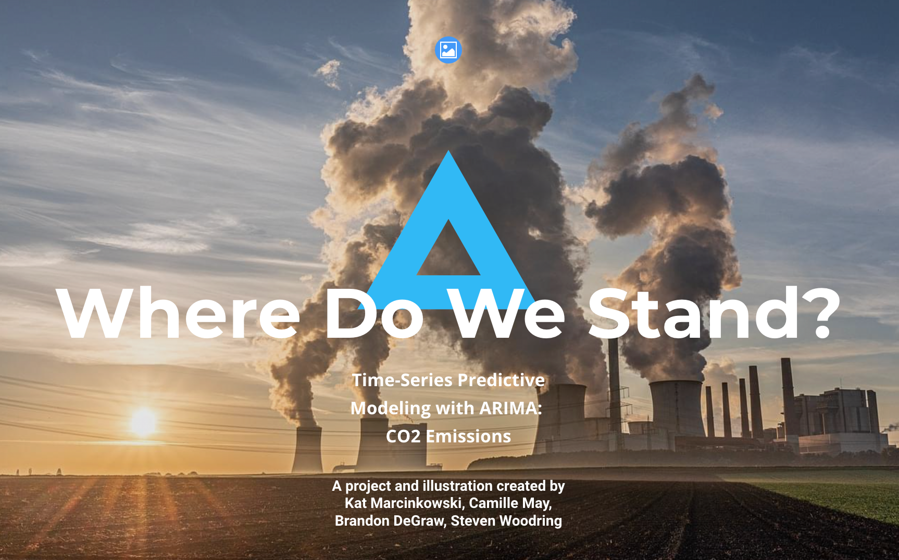
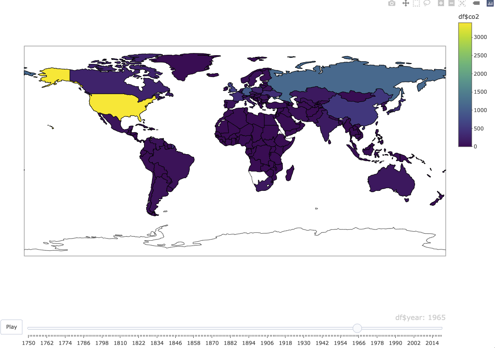

# Project: Forecast of CO2 Emissions



This team project aims to use past CO2 emissions data up until 2018 to predict future (2019 and 2020) emissions - then uses a machine learning model to test our hypothesis. The team is comprised of Brandon, Kat, Steven, and Camille. We believe that our prediction will be accurate in 2019 and inaccurate in 2020, since 2020 was a novel year. We will also use our model to forecast emissions data until 2050, since this is a benchmark year for reducing emissions targets.

### :mag_right: Background

We selected this topic because we wanted to work on a salient issue - and we also wanted to measure the accuracy of our machine learning model against actual data. Since there is so much research on emissions and environmental impact, this topic aligned with our goals. 

Our team selected world emissions data from [Our World in Data's Github page](https://github.com/owid/co2-data). Our World in Data is an open source website dedicated to monitoring greenhouse gas emissions, among other metrics, by country. They compile data from a variety of national and international sources on their website. 

### :bulb: Hypothesis 
We have several questions we expect that this data will answer. The main questions for our project are:
* Can our machine learning model accurately predict emissions data from now until 2050?
* How do changes in global surface temperatures affect emissions data, or vice versa?

### :memo: Team Communication Protocols 
We've decided to work asynchronously as much as possible, providing updates to each other in a group Slack. We meet on Mondays and Wednesdays via Zoom, where we think through any challenges we're facing and create a plan to address them. We each have our own branch in this repo where we push updates and may create separate repositories on our own accounts to create first drafts of code.

### :chart_with_upwards_trend: ARIMA model

For our time series data and forecasting model we chose to use an ARIMA model from ```statsmodels.tsa.arima.model```. Unfortunately, at this time there still needs to be work done to automate the analysis of CO2 corresponding to different countries. Each time series varies by the parameters ```ARIMA(p,d,q)``` where they need to be chosen carefully (overdifferencing can result in increased error when trying to establish stationarity). Below is a rolling ARIMA trained at each step to fine tune it's ability to forecast x amount of years into the future. Below is a comparison of the ARIMA model vs the test values along with a forecast of the model up until the year 2040 for China. There is still a way to immprove the model by forecasting our residual error to account for potential errors when forecasting, but this is yet to be implemented. As a baseline, this model seems to work rather well. 


### :earth_americas: Interactive Maps

CO2 emissions data relies on the time variable. Undoubtedly, CO2 emissions have been increasing as time goes on. Thus, it's important to determine interactive maps and plots to display this data.

I created a map with a time slider using Plotly in R to display CO2 emissions data globally as reported over time with the click of a button, "Play". This subtle interactivity provides users with an easy understanding of CO2 emissions changes over time and helps to answer broad questions users may have regarding regional or time differences.




### :gear: Website Development

The website "Where Do We Stand" is still in progress and not published yet. However, development of our website began on nicepage, a website builder software. We chose this platform because of its clean designs and it allows us to be creative yet efficient with our time and resources.

### :link: Meet Our Developers:

#### Brandon DeGraw

* Github: [@brand0j](https://github.com/brand0j)

#### Kat Marcinkowski

* Github: [@katmarcin](https://github.com/katmarcin)

#### Steven Woodring

* Github: [@Steven-Woodring](https://github.com/Steven-Woodring)

#### Camille May

* Github: [@camillecoding](https://github.com/camillecoding)


